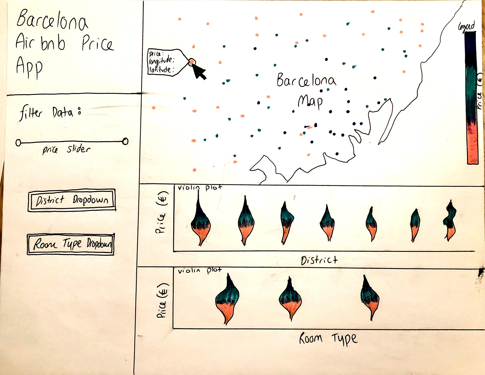

# Group 09
Repository for Kristina Wright and Daniel Hadley group project for [STAT 547M](https://stat545.stat.ubc.ca/)

## 1. About This Repository :information_source:
> This repository houses Group 09's project for STAT 547M taken in Term 2 of the 2019-2020 academic here.
>
> Our project uses an Airbnb dataset to try and find significant factors to explain the listing prices (per night) in Barcelona, Spain.
>
> The final report is created by meeting milestones which are linked below.

## 2. Navigating the Repository :file_folder:
> As milestones are met, files are placed into the appropriate subfolders. 

1. The [data](https://github.com/STAT547-UBC-2019-20/group_09/tree/master/data) folder contains all datasets used throughout the project.
1. The [docs](https://github.com/STAT547-UBC-2019-20/group_09/tree/master/docs) folder contains all `*.Rmd` files used to create reports.
1. The [images](https://github.com/STAT547-UBC-2019-20/group_09/tree/master/images) folder saves all images produced for the group project.
1. The [scripts](https://github.com/STAT547-UBC-2019-20/group_09/tree/master/scripts) folder saves all `R` scripts (`*.r`) that are called when rendering the project.
1. The [tests](https://github.com/STAT547-UBC-2019-20/group_09/tree/master/tests) folder contains all tests carried out when producing the analysis.

| Milestone | Due Date :date: | Report
| :--: | ---- | :--------------: |
| [01](https://stat545.stat.ubc.ca/evaluation/milestone_01/milestone_01/) | February 29, 2020 | [milestone01](https://stat547-ubc-2019-20.github.io/group_09/docs/milestone01/milestone01.html) |
| [02](https://stat545.stat.ubc.ca/evaluation/milestone_02/milestone_02/) | March 7, 2020 | [milestone02](https://stat547-ubc-2019-20.github.io/group_09/docs/milestone02/milestone02.html) |
| [03](https://stat545.stat.ubc.ca/evaluation/milestone_03/milestone_03/) | March 14, 2020 | [html](https://stat547-ubc-2019-20.github.io/group_09/docs/final_report.html) and [pdf](https://stat547-ubc-2019-20.github.io/group_09/docs/final_report.pdf) |

## 3. Usage :computer:

1. Clone this repo.

1. Ensure the following `R` packages are installed:

    - `tidyverse`
    - `here`
    - `docopt`
    - `knitr`
    - `DT`
    - `gridExtra`
    - `corrplot`
    - `glue`
    - `scales`
    - `broom`
  
1. Option 1: Run the following scripts (in order) in terminal from the main repo directory with the specified arguments:

    a) **Load data**
    `Rscript scripts/load.R --data_url=https://raw.githubusercontent.com/STAT547-UBC-2019-20/data_sets/master/listings-Barcelona.csv`
  
    b) **Clean data**
    `Rscript scripts/process.R --path_raw=data/raw_listings.csv --path_clean=data/clean_listings.csv`
  
    c) **Exploratory data analysis**
    `Rscript scripts/EDA.R --path_clean=data/clean_listings.csv --path_image=images/`
    
    d) **Linear Regression**
    `Rscript scripts/lm.R --path_data=data/clean_listings.csv`
  
    e) **Knit final report**
    `Rscript scripts/knit.R --final_report="docs/final_report.Rmd"`

1. Option 2: Run make in terminal from the main repo directory to run all individual scripts above:

    a) **Dependency**
    Ensure `make` is installed
    
    b) **Run all scripts and reproduce analysis**
    `make all`
    
    c) **Delete all output from scripts**
    `make clean`
    
## 4. Dash App Proposal
  
1. Dashboard description

This app will display a map of Barcelona with points that show the location of each listing that are colour coded by price. The exact price, longitude, and latitude will be displayed when hovering over the points.  A violin plot of price vs. district and price vs. room type will additionally be displayed. The price ranges plotted on the map and two violin plots can be adjusted using a two way slider.  Specific districts (ie. areas of Barcelona) and room types can filtered using two dropdown lists for replotting of the map and two violin plots.

2. Usage scenario

Asuna is looking to purchase a property in Barcelona to put up for rental on Airbnb. She wants to know what type of property she should purchase to make the most money by exploring a dataset that identifies the locations and room types that make the most money.  While surfing the internet, Asuna finds "Barcelona Airbnb Price App." She is able to see what is the most popular pricing for various districts in Barcelona and room types.  She thinks the most popular pricings will most likely have good booking rates and chooses a price slightly higher than the mean pricing in a higher priced district and room type listing to estimate her earnings.  Using this useful information, she can now make an informed decision on what type of property to purchase and what her expected net earnings are.
 
3. Dashboard sketch

