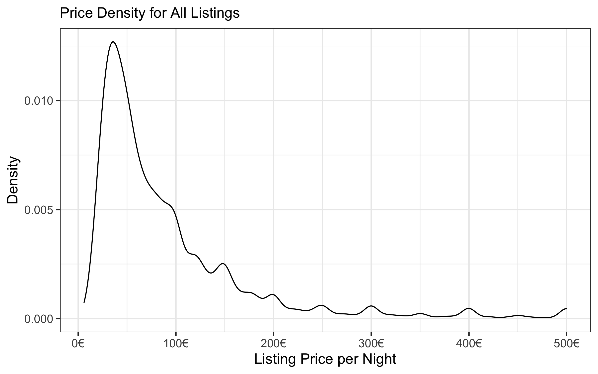

```{r setup, include=FALSE}
## Print code to html

library(knitr)
library(tidyverse)
library(DT) #In order to use the datatable() function for viewing tibbles
library(broom) #To view linear model results in a tidy fashion

```

## Airbnb Listings for Barcelona

### Introduction

Airbnb, Inc. is a company founded in 2008 that offers an online marketplace connecting people who offer lodging with people who require accomodations in that locale. The company does not own any of the listed properties and operates as a broker, collecting commissions once a lodging is booked. As a direct competitor to hotels, we are interested in how the users listing properties determine the price they charge.

When accomodations are offered through Airbnb, the person listing the property is called a host, and they must provide a variety of information about the listing including price, neighborhood, type of accommodations offered, and the minimum number of nights a guest must stay if they want to make a booking. In addition to information provided by the host, Airbnb collects and disseminates information about the listing which we use to perform our analysis.

The data is collected using public information compiled from the Airbnb website. Specific collection techniques are not specified, though the Inside Airbnb [website](http://insideairbnb.com/behind.html) states that it uses Open Source technologies such as D3, Boostrap, jQuery, etc. to collect the data and much code was "copied and pasted" from the internet. A major contributer to this code, [Tom Slee](http://tomslee.net/category/airbnb-data), described it as a "scrape" of the Airbnb website for each city.


### Data Description

The [dataset](http://insideairbnb.com/get-the-data.html) used in this analysis is collected and offered by Inside Airbnb, an independent, non-commercial project started by Murray Cox and John Morris. Their goal is to allow people to see how Airbnb might be affecting the residential housing market. We use the summary data for listings, since it includes the data we are interested in exploring and is more manageable, size-wise, than the detailed listings data.

The data used in this analysis was compiled on November 9, 2019 and includes 20,428 Airbnb listings that travellers see when using the Airbnb website to find accommodations in Barcelona, Spain. The table below describes the available data for each listing in the dataset.

| Variable Name | Column Name | Type of Data | Description
|---|---|---|---|
| Listing ID | `id` | Categorical/Numeric | Numeric identifier unique to each listing |
| Name | `name` | Character | Short title for the listing provided by the host |
| Host ID | `host_id` | Categorical/Numeric | Numeric identifier for the host of the listing |
| Host Name | `host_name` | Categorical/String | Name of the host or hosts of the listing provided by the host(s) to Airbnb |
| Neighbourhood Group | `neighbourhood_group` | Categorical/String | Districts of Barcelona as determined by the coordinates of the listing and the city's definition of its districts; this data is not the data provided by the host |
| Neighbourhood | `neighbourhood` | Categorical/String | Neighbourhoods of Barcelona are smaller geographical areas than districts and are determined by the coordinates of the listing and compared to the city's boundaries of its neighbourhoods; this data is not the neighbourhood provided by the host |
| Latitude | `latitude` | Numeric | Latitude coordinates of the listing |
| Longitude | `longitude` | Numeric | Longitude coordinates of the listing |
| Type of Accommodation | `room_type` | Categorical/String | Type of accommodations specify whether the listing is for an entire home or apartment, a private room in a shared home or apartment, a hotel room, or a shared room |
| Price | `price` | Numeric | The price per night, in euros, to book a listing |
| Minimum Stay | `minimum_nights` | Numeric | The minimum number of nights that a guest must reserve in order to book a listing |
| Number of Reviews | `number_of_reviews` | Numeric | The number of reviews left by guests after their stay |
| Last Review | `last_review` | Date | The date of the last review left by a guest |
| Reviews per Month | `reviews_per_month` | Numeric | The number of reviews left by guests of a listing divided by the number of months the listing has been active |
| Number of Listings by Host | `calculated_host_listings_count` | Numeric | A count of the number of listings under the same Host Name |
| Availability | `availability_365` | Numeric | The number of days over the next 365 days that the listing can be booked by guests; calculated as 365 minus booked days minus days listing is unavailable as per the host |

### Exploring the Dataset

#### Remove Unwanted Data

In this section, we remove columns from the dataset that should have no fundamental influence on listing price. This includes the short title of the listing (`name`), the name of the host(s) (`host_name`), and the availability of the listing over the next 365 days (`availability_365`). While there might end up being a relation between availability and price, since cheap listings for a desirable neighbourhood are likely to be booked, this relationship is backwards; we want to find factors that affect the listing price, not factors affected by the listing price. 


#### Rename Columns

Some of the column names are a little long, so we perform the following renamings:
  
  - `neighbourhood_group` is renamed to `district`
  
  - `minimum_nights` is renamed to `min_stay`
  
  - `number_of_reviews` is renamed to `reviews`
  
  - `calculated_host_listings_count` is renamed to `host_listings`
  

#### Filter Data

A few extreme outliers skew the density of the price of listings to the right.
As a result, we exclude the top 2.5\% of listings.
Then, we exclude listings with a minimum stay over 5 nights.
This should help to limit listings that are catered to tourists by eliminating listings that are better classified as short-term rentals.

#### Price Density

A kernel density plot is presented for listing prices.
An interesting observation from the price density is the tendency for people to price their listings in increments of 50 Euros. For example, the Density Plot, we see multi-modes, where each mode after the largest mode occurs at every 50 Euro increment along the x-axis

<center>

{width=650px}

</center>

#### Correlogram

Based on the correlogram shown below there is little correlation between the 6 numerical variables presented. All positive correlations are in blue, and all negative correlations are in red.

<center>

{width=500px}

</center>

#### Violin Plot

The violin plot below shows the distribution of price in log10 scale for each district in descending order of average price. Based on the plot, Example has the highest priced and Nou Barris has the lowest priced listings.

<center>

{width=675px}

</center>

### Analysis Methods

We perform linear regression on Airbnb listing prices to the listing's district, type of room, reviews left per month, and distance from city center to see how these variables might be affecting the Airbnb listing prices in Barcelona. First, we run 

`lm(price ~ district + room_type + distance + reviews_per_month, data=df)` 

where our data is housed in the dataframe, `df` and look at the QQ-Plots of the standardized residuals. This plot is given as the left plot below. It is obvious that normality assumptions are not appropriate, so we then run 

`lm(log(price) ~ district + room_type + distance + reviews_per_month, data=df)` 

and look at the QQ-plot for the log transform of price. This QQ-plot is given below on the right and is much closer to the normality assumption even though there is evidence of heavier tails.

<center>

{width=600px}

{width=600px}

</center>

### Analysis Results

First, let's look at the results of the linear regression for the untransformed price response variable. In the output below, we see that only 2 of the 10 districts, with Ciutat Vella as the base district, are statistically significant at the 95\% confidence level. These are Eixample and Sarri&#224;-Sant Gervasi. 

```{r lm-results}
#Linear Model on Price
lm.1 <- readRDS(file=here::here("data", "lm1_results.rds"))
tidy(lm.1)
```

We can interpret the estimate for Eixample, `r round(tidy(lm.1)[2,'estimate'], 1)`, as saying that prices of Airbnb listings in the Eixample district differ from listings in the Ciutat Vella district, on average, by `r round(tidy(lm.1)[2,'estimate'], 1)` Euro's per night. All room types, distance, and reviews per month are statistically significant at any reasonable confidence level.

Next, we look at the results of the linear regression on the log(price) of Airbnb listings. In the output below, we see many more districts are now statistically significant, but the interpretation of their coefficient estimates are not as straightforward as the results when regressing on listing price.

```{r lmlog-results}
#Linear Model on log(Price)
lm.2 <- readRDS(file=here::here("data", "lm2_results.rds"))
tidy(lm.2)
```

Due to the improved QQ-Plot for the log(price) model, we only consider this model's results going forward. We can look at how well this model fits the data by randomly selecting 10 listings and comparing the price to the fitted price. 

```{r fitted-price}
set.seed(100)
augment(lm.2) %>% 
  slice(sample(1:nrow(augment(lm.2)), size=10, replace=FALSE)) %>% 
  select(.rownames, district, room_type, distance, reviews_per_month, log.price., .fitted) %>% 
  rename(price = log.price.,
         fitted = .fitted) %>% 
  mutate(price = exp(price),
         fitted = exp(fitted))
```

In the output above, the `price` columns shows the listing's price from the Airbnb website and `fitted` shows the price given by the linear model. Note that we exponentiated this output so that it is in Euro's and straightforward to compare.

Finally, we can look at the adjusted r-squared to see how much of the variance in listing price is explained by district, type of room, distance of city center, and reviews per month. By using the `glance()` function from the `broom` package, we see that `r round(glance(lm.2)$adj.r.squared, 4)*100`\% of the variance of the log transform of listing is explained by our model.


### Discussion 

Based on the results of our model using the log transform of listing price, district, type of room, distance from city center, and reviews per month all play a significant role in the price of an Airbnb listing. However, much of the variance is left unexplained in our model so that we may want to look for additional variables.


### References

[Airbnb dataset](http://insideairbnb.com/get-the-data.html)
